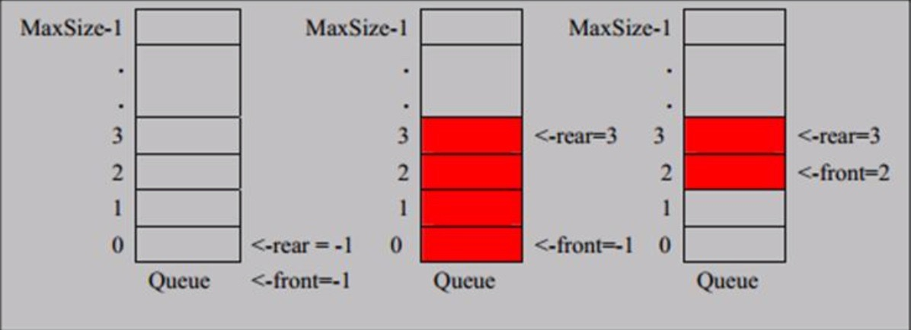

# Implementing Data Structure with Java
<!-- TOC -->
[Implementing Data Structure with Java](#implementing-data-structure-with-java)  
[No.1 稀疏矩阵（SparesArray）](#no1-稀疏矩阵sparesarray)  
[Demo](#demo)  
[No.2 队列的数组实现](#no2-队列的数组实现)  
[2.1  基本队列实现](#21--基本队列实现)  
[队列实现:](#队列实现)  
[Test:](#test)  
[2.2 数组实现环形队列（模运算实现）](#22-数组实现环形队列模运算实现)  
[Test:](#test-1)  
[No.3 链表](#no3-链表)  
[3.1单链表的基本实现](#31单链表的基本实现)  
[节点：](#节点)  
[单链表实现](#单链表实现)  
[Test:](#test-2)  
[3.2单链表面试题](#32单链表面试题)  
[3.2.1 求单链表中有效节点的个数](#321-求单链表中有效节点的个数)  
[3.2.2 查找单链表中倒数第k个节点](#322-查找单链表中倒数第k个节点)  
[3.2.3 链表的反转](#323-链表的反转)  
[3.2.4 链表的反向遍历](#324-链表的反向遍历)  
[3.2.5 合并两个有序的链表](#325-合并两个有序的链表)  
[心得](#心得)  
[3.3 双向链表的实现](#33-双向链表的实现)  
[节点](#节点)  
[**双向链表的实现**](#双向链表的实现)  
[Demo](#demo-1)
<!-- /TOC -->
## No.1 稀疏矩阵（SparesArray）

> 如果原始矩阵中有着大量重复数据可以转换为稀疏矩阵来压缩空间，通过一个三列的二维数组来记录原始数据的大小、非大量重复数据的出现位置以及对应的值

#### Demo

```java
package cn.lll.dataStructure.SparesArray;

import org.junit.Before;

/**
 * 稀疏矩阵<-->原始矩阵的互相转换
 * @date : 2019.06.18
 * 通过一个三列的二维数组来记录原始数组的大小、非重复数据出现的位置以及对应的值
 */
public class SparesArray {
    public static void main(String args[]) {
        /**
         *初始化原始矩阵
         * @param sum 统计有效数据
         * @param invalid 无效数据
         */
        int[][] originalArray = new int[11][11];
        originalArray[1][3] = 1;
        originalArray[0][2] = 2;
        int sum = 0;
        int invalid = 0;

        /**
         * 遍历数据
         */
        System.out.println("Original Array:");
        for (int i = 0; i < originalArray.length; i++) {
            for (int j = 0; j < originalArray[i].length; j++) {
                //组合稀疏数组
               if (originalArray[i][j] != 0) {
                    sum++;
                }
                System.out.printf("%d\t", originalArray[i][j]);
            }
            System.out.println();
        }

        /**
         * 初始化稀疏矩阵
         * @param count 计数有效元素
         */
        int[][] sparesArray = new int[sum+1][3];
        int count = 1;
        //转换为稀疏矩阵
        for (int i = 0; i < originalArray.length; i++) {
            for (int j = 0; j < originalArray[i].length; j++) {
                //组合稀疏数组
                if (originalArray[i][j] != 0) {
                    sparesArray[count][0] = i;
                    sparesArray[count][1] = j;
                    sparesArray[count][2] = originalArray[i][j];
                    count++;
                }
            }
        }

        sparesArray[0][0] = originalArray.length;
        sparesArray[0][1] = originalArray[0].length;
        System.out.println("Spares Array: ");
        for (int i = 0; i < sparesArray.length; i++) {
            for (int j = 0; j < sparesArray[i].length; j++) {
                System.out.printf("%d\t", sparesArray[i][j]);
            }
            System.out.println();
        }

        /**
         * 转换为原始矩阵
         */
        System.out.println("Original Arrays: ");
        int newArray[][] = new int[sparesArray[0][0]][sparesArray[0][1]];
        for(int i=1;i<sparesArray.length;i++){
                newArray[sparesArray[i][0]][sparesArray[i][1]] = sparesArray[i][2];
        }

        for (int []array:newArray
             ) {
            for (int data:array
                 ) {
                System.out.printf("%d\t",data);
            }
            System.out.println();
        }
    }


}

```

## No.2 队列的数组实现

### 2.1  基本队列实现

* 队列是一个有序列表，可以用数组或是链表来实现。

* 遵循先入先出的原则。即:先存入队列的数据，要先取出。后存入的要后取出

> **数组基本实现原理**

> > 队列本身是有序列表，若使用数组的结构来存储队列的数据，则队列数组的声明如下图, 其中 maxSize 是该队 列的最大容量。 因为队列的输出、输入是分别从前后端来处理，因此需要两个变量 front 及 rear 分别记录队列前后端的下标， front 会随着数据输出而改变，而 rear 则是随着数据输入而改变，如图所示: 



#### 队列实现:

```java
package cn.lll.dataStructure.Queue;

public class ArrayQueue {
    private int maxSize; //表示数组的最大容量
    private int front; //队列头
    private int rear; //队列尾
    private int []arr; //数据域

    /**
     * 创建构造器
     * @param arrMaxSize 最大容量
     *
     */
    public ArrayQueue(int arrMaxSize){
        this.maxSize = arrMaxSize;
        arr = new int[maxSize];
        front = -1; //指向队列头的前一个位置
        rear = -1; //指向最后一个数据
    }

    /**
     * 队列是否已满
     * @return
     */
    public boolean isFull(){
        return rear == maxSize-1;
    }

    /**
     * 判断队列是否为空
     * @return
     */

    public boolean isEmpty(){
        return rear==front;
    }
    /**
     * 添加数据
     * @param n 插入的数据
     */
    public void addQueue(int n){
        if(isFull()){
            System.out.println("队列满，不能加入数据");
            return;
        }
        rear++;// 末尾指针后移
        arr[rear] = n;
    }

    /**
     * 取数据
     * @return
     */
    public int getQueue(){
        if(isEmpty()){
            throw new RuntimeException("队列空，不能取数据");
        }
        front++;//头指针后移
        int data = arr[front];
        arr[front] = 0;
        return data;
    }

    /**
     * 遍历队列
     */
    public void showQueue(){
        if(isEmpty()){
            System.out.println("队列空，无法遍历");
            return;
        }
        for(int i=0;i<arr.length;i++){
            System.out.printf("arr[%d]=%d",i,arr[i]);
        }
        System.out.println();
    }

    /**
     * 显示队列顶部数据
     * @return
     */
    public int headQueue(){
        if(isEmpty()){
            throw new RuntimeException("The queue is empty!");
        }
        return arr[front+1];
    }

}

```

#### Test:

```java
package cn.lll.dataStructure.Queue;

import java.util.Scanner;

public class ArrayQueueDemo {
    public static void main(String args[]){
        ArrayQueue queue = new ArrayQueue(3);
        char key;
        Scanner scanner = new Scanner(System.in);
        boolean loop =true;
        while (loop){
            System.out.println("s:显示队列");
            System.out.println("e: exit the programmer");
            System.out.println("a : add  data to queue ");
            System.out.println("g : get data from queue");
            System.out.println("h: search for the head of queue");
            key = scanner.next().charAt(0);
            switch (key){
                case 's':
                    queue.showQueue();
                    break;
                case 'a':
                    System.out.println("输出一个数字");
                    int value = scanner.nextInt();
                    queue.addQueue(value);
                    break;
                case 'g':
                    try {
                        int res = queue.getQueue();
                        System.out.println(res);
                    }catch (Exception e){
                        System.out.println(e.getMessage());
                    }
                    break;
                case'h':
                    try {
                        int res = queue.headQueue();
                        System.out.println(res);
                    }catch (Exception e){
                        System.out.println(e.getMessage());
                    }
                    break;
                case 'e':
                    scanner.close();
                    loop = false;
                    break;
                    default:
                        break;
            }
        }
        System.out.println("programmer exited");
    }
}

```

### 2.2 数组实现环形队列（模运算实现）

> **实现思路**

> > front索引指向队列的第一个元素，rear索引指向最后一个元素的后一个位置，且初始值均为0，当**front==rear**时，表示队列空，当**（rear+1）% maxSize==front**时，表示队列满，队列中有效的数据个数为**（rear+maxSize-front）%maxSize**,如图：


 #### 环形队列:

```java
package cn.lll.dataStructure.Queue;

/**
 * 对数据求模是为了达到循环复用的目的
 */
public class CircleQueue {
    private int maxSize; //最大容量
    private int front;// front指向队列的第一个元素
    private int rear; //rear 指向最后一个元素的后一个位置
    private int []arr;//数据域

    /**
     * 构造器
     * @param arrMaxSize 队列最大数据
     */
    public CircleQueue(int arrMaxSize){
        this.maxSize = arrMaxSize;
        this.arr = new int[maxSize];

    }

    /**
     * 判读队列是否满
     * @return
     */
    public  boolean isFull(){
        return (rear+1)%maxSize == front;
    }

    /**
     * 判读队列是否为空
     * @return
     */
    public boolean isEmpty(){
        return rear==front;
    }
    public void addQueue(int n){
        if(isFull()) {
            System.out.println("queue is full....");
            return;
        }
        arr[rear] = n;
        rear = (rear+1)%maxSize; //real 后移
    }

    /**
     * 取数据
     * @return
     */
    public int getQueue(){
        if(isEmpty()){
            throw new RuntimeException("the queue is empty....");
        }
        int value = arr[front];
        arr[front] = 0;
        front = (front+1)%maxSize;
        return value;
    }

    /**
     * 遍历数据
     */
    public void showqueue(){
        if(isEmpty()){
            System.out.println("the queue is empty");
            return;
        }
        for(int i=front;i<front+size();i++){
            System.out.printf("arr[%d]=%d\n",i%maxSize,arr[i%maxSize]);
        }
    }

    /**
     * 求出队列有多少数据
     * @return
     */
    public int size(){
        return (rear+maxSize-front)%maxSize;
    }

    public int headQueue(){
        if(isEmpty()){
            throw new RuntimeException("队列空的，没有数据～～");
        }
        return arr[front];
    }

}

```

#### Test:

```java
package cn.lll.dataStructure.Queue;

import java.util.Scanner;

public class CircleQueueDemo {
    public static void main(String args[]) {
        CircleQueue queue = new CircleQueue(4); //实际最大数据为3
        char key;
        Scanner scanner = new Scanner(System.in);
        boolean loop = true;
        while (loop){
            System.out.println("s : show the queue");
            System.out.println("e: exit the queue");
            System.out.println("a :add data to the queue");
            System.out.println("g : get data to the queue");
            System.out.println("h: search for the first of the queue");
            key = scanner.next().charAt(0);
            switch (key){
                case 's':
                    queue.showqueue();
                    break;
                case 'a':
                    System.out.println("enter a number:");
                    int value = scanner.nextInt();
                    queue.addQueue(value);
                    break;
                case 'g':
                    try{
                        int res = queue.getQueue();
                        System.out.println(res);
                    }catch (Exception e){
                        e.getMessage();
                    }
                    break;
                case 'h':
                    try {
                        int res = queue.headQueue();
                        System.out.println(res);
                    }catch (Exception e){
                        e.getMessage();
                    }
                    break;
                case 'e':
                    scanner.close();
                    loop = false;
                    break;
                    default:
                        scanner.close();
                        break;
            }
        }
        System.out.println("exit.....");
    }
}

```

## No.3 链表

> **链表介绍**
>
> - 链表是以节点的方式来存储,是链式存储
> -  每个节点包含 data 域， next 域:指向下一个节点.
> -  如图:发现链表的各个节点不一定是连续存储.
> - 链表分带头节点的链表和没有头节点的链表，根据实际的需求来确定

### 3.1单链表的基本实现

> * 构建节点
>
>   > 节点中包括指向下一个节点的地址索引next和数据域 data
>
> * 创建单链表
>
>   > ​	单链表的功能部分：增删改查等等
>
> 


#### 节点：

```java
package cn.lll.dataStructure.SingleLinkedList;

/**
 * 定义对象节点
 */
public class HeroNode {
    public int no;
    public String name;
    public String nickName;
    public  HeroNode next; //指向下一个节点
    /**
     * 创建构造器
     */
    public HeroNode(int no, String name, String nickName) {
        this.no = no;
        this.name = name;
        this.nickName = nickName;
    }

    @Override
    public String toString() {
        return "HeroNode{" +
                "no=" + no +
                ", name='" + name + '\'' +
                ", nickName='" + nickName + '\'' +
                '}';
    }
}


```

#### 单链表实现

```java
package cn.lll.dataStructure.SingleLinkedList;

public class SingleLinkedList {
    //初始化头节点
    private HeroNode head = new HeroNode(0,"","");
    /**
     * 添加节点，不考虑顺序
     * 1，找到当前链表的最后节点
     * 2，将这个节点的next指向新的节点
     */
    public void add(HeroNode heroNode){
        //head 不能动，因此先进行遍历
        HeroNode temp = head;
        while (true){
            //链表末尾
            if(temp.next == null){
                break;
            }
            temp = temp.next;
        }
        temp.next = heroNode;
    }

    /**
     *第二种添加方式根据排名将英雄放入到指定位置
     * 如果已有则添加失败并且给出提示
     */
    public void addByOrder(HeroNode heroNode){
        //头节点不能移动，仍然通过一个辅助指针来找到添加的位置
        //我们寻找的temp必须位于添加位置的前一个节点，否则插入失败
        HeroNode temp = head;
        boolean flag = false;
        while (true){
            if(temp.next.no == heroNode.no){
                flag = true;
                break;
            }
            temp = temp.next;
        }
        if (flag) {
            System.out.println("the hero is already exists....");
        }else {
            heroNode.next = temp.next;
            temp.next = heroNode;
        }
    }

    /**
     * 修改节点信息，根据no编号来修改，no不能改
     */
    public void update(HeroNode newHeroNode){
        if(head.next==null){
            System.out.println("The linkedList is empty");
            return;
        }
        //找到需要修改的节点，根据no编号
        HeroNode temp = head.next;
        boolean flag = false; //表示是否找到该节点
        while (true){
            if(temp == null){
                break;
            }
            if (temp.no == newHeroNode.no){ //已找到
                flag = true;
                break;
            }
            temp = temp.next;
        }
        if(flag){
            temp.name = newHeroNode.name;
            temp.nickName = newHeroNode.nickName;
        }else {
            System.out.println(" the hero is undefine....");
        }
    }

    /**
     * 删除节点
     * 1，head不能动，因此需要一个temp
     * 2，将temp.next.no 与需要删除的节点no进行比较
     *
     */

    public void del(int no){
        HeroNode temp = head;
        boolean flag = false;

        while (true){

            if(temp.next == null){
                break;
            }

            if(temp.next.no == no){
                flag = true;
                break;
            }
            temp = temp.next;
        }
        if(flag){
            temp.next = temp.next.next;
        }else {
            System.out.println("the node is undefine");
        }

    }

    /**
     * 遍历链表
     */
    public void list(){
        if(head.next == null){

            System.out.println("the linkedList is null");
        }

        HeroNode temp = head.next;

        while (true){

            if(temp == null){
                break;
            }
            System.out.println(temp);
            temp = temp.next;
        }
    }
}

```

#### Test:

```java
package cn.lll.dataStructure.SingleLinkedList;

public class SingleLinkedListDemo {
    public static void main(String  args[]){
        //初始化节点
        HeroNode hero1 = new HeroNode(1, "宋江", "及时雨");
        HeroNode hero2 = new HeroNode(2, "卢俊义", "玉麒麟");
        HeroNode hero3 = new HeroNode(3, "吴用", "智多星");
        HeroNode hero4 = new HeroNode(4, "林冲", "豹子头");
        SingleLinkedList singleLinkedList = new SingleLinkedList();
        //添加
        singleLinkedList.add(hero1);
        singleLinkedList.add(hero4);
        singleLinkedList.add(hero2);
        singleLinkedList.add(hero3);
        //显示
        singleLinkedList.list();
        //修改
        HeroNode heroNode = new HeroNode(2, "小鲁", "玉麒麟");
        singleLinkedList.update(heroNode);
        //查看情况
        System.out.println("--------------------------");
        singleLinkedList.list();
        //删除
        singleLinkedList.del(1);
        singleLinkedList.del(2);
        System.out.println("--------------------------");
        singleLinkedList.list();
    }
}

```

### 3.2单链表面试题

#### 3.2.1 求单链表中有效节点的个数

> > 遍历链表统计节点数，使用一个temp作为地址索引

```java
public  int getLength() {
        //如果链表为空
        if (head.next == null) {
            return 0;
        }
        int length = 0;
        //定义一个辅助变量，不统计头节点
        HeroNode temp = head.next;
        while (temp != null){
            length++;
            temp = temp.next;
        }
        return length;
    }
```

#### 3.2.2 查找单链表中倒数第k个节点

> > * 编写一个方法，介绍head节点，同时接收一个index
> > * index表示是倒数第index个节点
> > * 先把链表从头到尾遍历，得到链表长度总和
> > * 得到size后，再次遍历到（size-index）个
> > * 如果找到返回该节点，否则返回null

```java
public static HeroNode findLastIndexNode(HeroNode head, int index) {
        //如果链表为空，则返回null
        if (head.next == null) {
            return null;
        }
        //遍历链表长度
        int size = 0;
        HeroNode temp = head.next;
        while (true) {
            if (temp == null) {
                break;
            }
            temp = temp.next;
            size++;
        }
        if (index <= 0 || index > size) {
            return null;
        }
        HeroNode cur = head.next;

        for (int i = 0; i < size - index; i++) {
            cur = cur.next;
        }
        return cur;
    }
```

#### 3.2.3 链表的反转

> * 当链表为空或者只有一个节点则无需反转
> * 通过建立一个新链表来接收原始链表的遍历，并且将节点每次都放置在新链表的最前端
> * 最后将新链表连接到原始链表的头部

```java
 public static void reversetList(HeroNode head){
        //如果当前链表为空，或者只有一个节点，无需反转
        if(head.next == null || head.next.next == null){
            return;
        }
        //定义辅助指针，帮助遍历原来的链表

        HeroNode temp = head.next;
        HeroNode next = null; //指向当前节点的下一个节点
        HeroNode heroNodeHead = new HeroNode(0, "", ""); //新链表头节点
        //遍历原始链表，每遍历一个节点就将其取出，并放置在新链表中
        while (temp!=null){
            next = temp.next; //先暂存当前节点的下一个节点
            temp.next = heroNodeHead.next; //将temp的下一个节点指向新链表的最前端
            heroNodeHead.next = temp; //将temp连接到新的链表上
            temp = next; //temp后移
        }
        //将head.next 指向 heroNodeHead.next完成反转
        head.next = heroNodeHead.next;
    }
```

#### 3.2.4 链表的反向遍历

> **思路分析**
>
> > 利用栈这个数据结构，将各个节点压入栈内，然后利用栈的特性实现反向遍历

```java
 public static void reversePrint(HeroNode head){
        if(head.next ==null){
            return; //空链表无法打印
        }
        Stack<HeroNode> stack = new Stack<HeroNode>();
        HeroNode cur = head.next;
        //链表所有节点入栈
        while (cur!=null){
            stack.push(cur);
            cur = cur.next;

        }
			//	利用栈遍历逆序的链表
        while (stack.size()>0){
            System.out.println(stack.pop());
        }
    }
```

#### 3.2.5 合并两个有序的链表

> **思路**
>
> > * 判断是否有链表为空：如果l1为空，则不用比较直接返回l2，如果l1为空，则直接返回l2；
> >
> > * 比较l1和l2节点，选出最小的那个节点，将该节点设为合并后的链表的head(头)节点，同时将指向该节点的l1或l2后移，方便接下来的比较；
> >
> > * 设置一个变量temp指向head节点，用于之后连接其它节点；
> >   再比较l1和l2节点，同样选出小的那个节点，将该节点设为合并后的链表的第二个节点，用temp.next表示该节点，同时将指向该节点的l1或l2后移；
> >   重复比较l1和l2节点，直到l1或l2节点为null；
> >
> > * 此时，必定有一个链表中的所有节点都放入了新链表中，只要将另一个链表中的剩余的所有节点都接到新链表之后就可以了。
> >
> >   **链表中 Node temp = head ，temp就指向head的地址，对temp的操作会连接在head中** 

> #### 非递归

```java
 public static ListNode merge2(ListNode l1,ListNode l2){
   //处理空链表
        if (l1 == null || l2 == null) {
            return l1 == null ? l2 : l1;
        }
   //确定头节点
        ListNode head = null;
        if(l1.val <=l2.val){
            head = l1;
            l1 = l1.next;
        }else {
            head = l2;
            l2 = l2.next;
        }
        ListNode temp = head; //建立地址索引连接头节点
   //开始合并
        while (l1 != null && l2 != null){
            if(l1.val <= l2.val){
                temp.next = l1;
                l1 = l1.next;
            }else {
                temp.next = l2;
                l2 = l2.next;
            }
            temp =temp.next;
        }
   //连接余下链表节点
        if(l1 == null){
            temp.next = l2;
        }else if(l2 == null){
            temp.next = l1;
        }
        return head;
    }
```

> ### 递归实现
>
> 

```java
  public static ListNode merge(ListNode l1, ListNode l2) {
    //解决空链表
        if (l1 == null || l2 == null) {
            return l1 == null ? l2 : l1;
        }
        ListNode head = null;
    //开始组合
        if (l1.val <= l2.val) {
            head = l1;
            head.next = merge(l1.next, l2);
        } else {
            head = l2;
            head.next = merge(l1, l2.next);
        }
        return head;
    }
```

#### 心得

> * 单链表的查找一定是单一方向
> * temp = head temp就继承了head的地址
> * 单链表的操作都需要借助地址索引辅助

### 3.3 双向链表的实现

> **思路** 
>
> 1) 遍历 方和 单链表一样，只是可以向前，也可以向后查找
> 2) 添加 (默认添加到双向链表的最后)
> (1) 先找到双向链表的最后这个节点
> (2) temp.next = newHeroNode
> (3) newHeroNode.pre = temp;
> 3) 修改 思路和 原来的单向链表一样.
> 4) 删除
> (1) 因为是双向链表，因此，我们可以实现自我删除某个节点
> (2) 直接找到要删除的这个节点，比如 temp
> (3) temp.pre.next = temp.next
> (4) temp.next.pre = temp.pre;

#### 节点

```java
package cn.lll.dataStructure.DoubleLinkedList;

public class HeroNode {
    public int no;
    public String name;
    public String nickName;
    public HeroNode next; //指向下一个节点
    public HeroNode pre; //指向前一个节点

    public HeroNode(int no, String name, String nickName) {
        this.no = no;
        this.name = name;
        this.nickName = nickName;
    }

    @Override
    public String toString() {
        return "HeroNode{" +
                "no=" + no +
                ", name='" + name + '\'' +
                ", nickName='" + nickName + '\'' +
                '}';
    }
}

```

#### **双向链表的实现**

```java
package cn.lll.dataStructure.DoubleLinkedList;

public class DoubleLinkedList {
    //初始化一个头节点，头节点不动，不存放具体数据
    private HeroNode head = new HeroNode(0,"","");

    /**
     * 返回头节点
     */
    public HeroNode getHead(){
        return head;
    }

    /**
     * 遍历双向链表
     */
    public void list(){

        //判断链表是否为空
        if(head.next == null){
            System.out.println("the linked is empty!");
            return;
        }

        HeroNode temp = head.next;
        while (true){
            if(temp == null){
                break;
            }

            // 输出节点信息
            System.out.println(temp);
            //temp后移
            temp = temp.next;
        }

    }

    /**
     * 添加链表
     * @param heroNode 添加的节点
     */
    public void add(HeroNode heroNode){
        HeroNode temp = head;
        //寻找最后一个节点
        while (true){
            if(temp.next == null){
                break;
            }
            temp = temp.next;
        }
        //形成一个双向链表
        temp.next = heroNode;
        heroNode.pre = temp;
    }

    /**
     * 修改节点
     * @param newHeroNode
     */
    public void update(HeroNode newHeroNode){
        if(head.next == null){
            System.out.println("the linkedlist is empty!");
            return;
        }

        //寻找需要修改的节点
        //定义地址索引
        HeroNode temp = head.next;
        boolean flag = false;
        while (true){
            if(temp == null){
                break;
            }

            //找到节点
            if(temp.no == newHeroNode.no){
                flag = true;
                break;
            }
            temp = temp.next;
        }

        if(flag){
            temp.name = newHeroNode.name;
            temp.nickName = newHeroNode.nickName;
        }else { //没有找到
            System.out.println("the node is undefine!");
        }

    }

    /**
     * 删除节点
     * @param no 节点编号
     */
    public void del(int no){
        //judging weather the linkedlist is empty
        if(head.next == null){
            System.out.println("the linkedlist is empty !");
            return;
        }

        //define an auxiliary variable
        HeroNode temp = head.next;
        boolean flag = false; //sign Location
        while (true){
            if(temp == null){
                break;
            }
            if(temp.no == no){
                flag = true;
                break;
            }
            temp = temp.next;
        }

        if(flag){
            //System.out.println(flag);
            //found
            temp.pre.next = temp.next;
            if(temp.next !=null){
                temp.next.pre = temp.pre;
            }
        }else {
            System.out.println("the node is undefine!");
        }
    }
}

```

#### Demo

```java
package cn.lll.dataStructure.DoubleLinkedList;

public class Demo {
    public static void main(String args[]){
        HeroNode hero1 = new HeroNode(1, "宋江", "及时雨");
        HeroNode hero2 = new HeroNode(2, "卢俊义", "玉麒麟");
        HeroNode hero3 = new HeroNode(3, "吴用", "智多星");
        HeroNode hero4 = new HeroNode(4, "林冲", "豹子头");

        DoubleLinkedList doubleLinkedList = new DoubleLinkedList();
        doubleLinkedList.add(hero1);
        doubleLinkedList.add(hero2);
        doubleLinkedList.add(hero3);
        doubleLinkedList.add(hero4);
        System.out.println("-------------------------------------");
        doubleLinkedList.list();
        System.out.println("-------------------------------------");
        HeroNode heroNode = new HeroNode(4,"公孙胜","入云龙");
        doubleLinkedList.update(heroNode);
        doubleLinkedList.list();
        System.out.println("------------------------------------");
        doubleLinkedList.del(4);
        doubleLinkedList.list();
        System.out.println("------------------------------------");

    }
}

```

